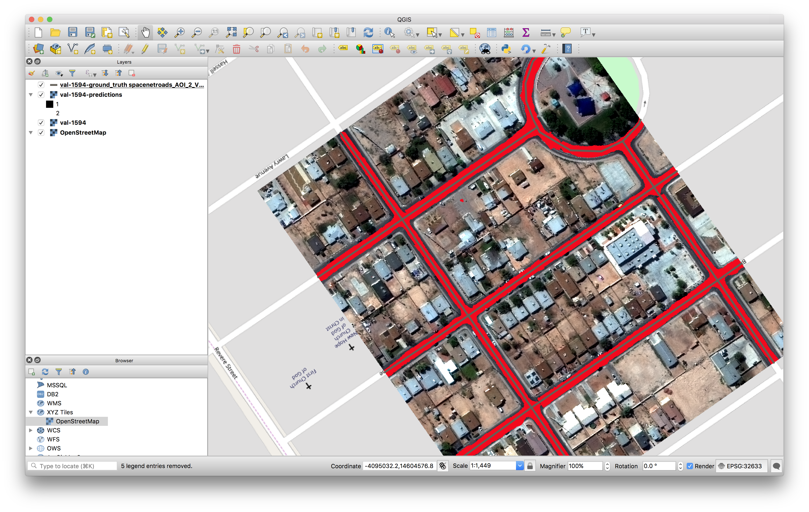
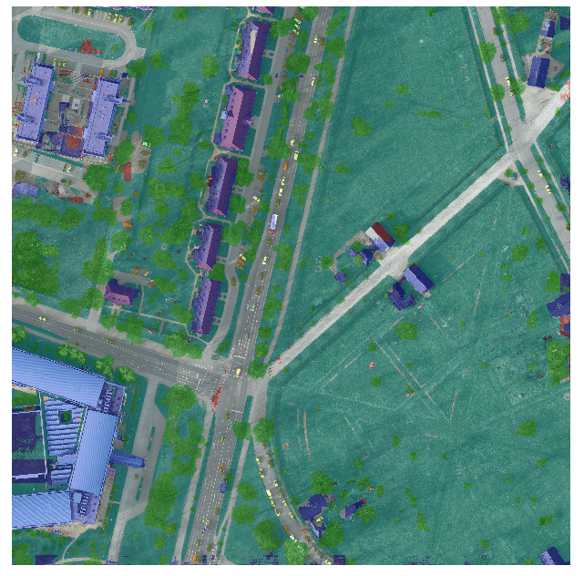
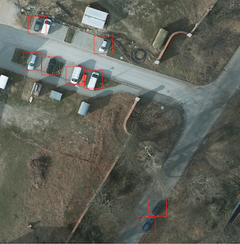

# Raster Vision Examples

This repository contains examples of using Raster Vision on open datasets.

Note: The `master` branch of this examples repo should be used in conjunction with the `master` branch (or `latest` Docker image tag) of [Raster Vision](https://github.com/azavea/raster-vision)
which contains the latest changes. For versions of this examples repo that correspond to stable, released versions of Raster Vision, see:
* [0.9](https://github.com/azavea/raster-vision-examples/tree/0.9)

Table of Contents:
- [Setup and Requirements](#setup-and-requirements)
- [How to Run an Example](#how-to-run-an-example)
    - [SpaceNet Rio Building Chip Classification (demonstrates data prep)](#spacenet-rio-building-chip-classification)
- [Visualization using QGIS](#visualization-using-qgis)
- [Other examples](#other-examples)
    - [SpaceNet Rio Building Semantic Segmentation](#spacenet-rio-building-semantic-segmentation)
    - [SpaceNet Vegas](#spacenet-vegas)
        - [Simple Segmentation (easy to run and understand)](#spacenet-vegas-simple-semantic-segmentation)
        - [Roads and Buildings: All Tasks (demonstrates multiple tasks, line string, class filter, vector tiles, polygon output)](#spacenet-vegas-all-tasks)
        - [Hyperparameter Search (demonstrates branching experiment structure)](#spacenet-vegas-hyperparameter-search)
    - [ISPRS Potsdam Semantic Segmentation (demonstrates RGB input/output, multiple classes)](#isprs-potsdam-semantic-segmentation)
    - [COWC Potsdam Car Object Detection](#cowc-potsdam-car-object-detection)
    - [xView Vehicle Object Detection (demonstrates data prep)](#xview-vehicle-object-detection)
- [Model Zoo](#model-zoo)

## Setup and Requirements

### ⚠️ PyTorch vs. Tensorflow Backends

Raster Vision is in the process of switching from Tensorflow to PyTorch-based backends. Currently, there is support for chip classification, semantic segmentation, and object detection using Tensorflow, and chip classification, and semantic segmentation using PyTorch. We do not plan to maintain the Tensorflow backends, and they may be removed in the future, so we suggest starting to use the PyTorch ones.

The examples in this repo default to using PyTorch backends, except for the object detection examples. In addition, for two of the examples ([examples.potsdam.semantic_segmentation](examples/potsdam/semantic_segmentation.py) and [examples.spacenet.rio.chip_classification](examples/spacenet/rio/chip_classification.py)), there is a `use_tf` option which allows running it using a Tensorflow backend.

### Docker
You'll need `docker` (preferably version 18 or above) installed. After cloning this repo, to build the Docker images, run the following command:

```shell
> docker/build
```

This will pull down the latest `raster-vision:pytorch-latest`, `raster-vision:tf-cpu-latest`, and `raster-vision:tf-gpu-latest` Docker images and add some of this repo's code to them. If you only want the Tensorflow images, use the `--tf` flag, and similar for `--pytorch`. Before running the container, set an environment variable to a local directory in which to store data.
```shell
> export RASTER_VISION_DATA_DIR="/path/to/data"
```
To run a Bash console in the Docker container, invoke:
```shell
> docker/run
```
This will mount the following local directories to directories inside the container:
* `$RASTER_VISION_DATA_DIR -> /opt/data/`
* `examples/ -> /opt/src/examples/`

This script also has options for forwarding AWS credentials, running Jupyter notebooks, and switching between different images, which can be seen below.

**Remember to use the correct image for the backend you are using!**

```
> ./docker/run --help
Usage: run <options> <command>
Run a console in the raster-vision-examples-cpu Docker image locally.

Environment variables:
RASTER_VISION_DATA_DIR (directory for storing data; mounted to /opt/data)
AWS_PROFILE (optional AWS profile)
RASTER_VISION_REPO (optional path to main RV repo; mounted to /opt/src)

Options:
--aws forwards AWS credentials (sets AWS_PROFILE env var and mounts ~/.aws to /root/.aws)
--tensorboard maps port 6006
--gpu use the NVIDIA runtime and GPU image
--name sets the name of the running container
--jupyter forwards port 8888, mounts ./notebooks to /opt/notebooks, and runs Jupyter
--debug maps port 3007 on localhost to 3000 inside container
--tf-gpu use raster-vision-examples-tf-gpu image and nvidia runtime
--tf-cpu use raster-vision-examples-tf-cpu image
--pytorch-gpu use raster-vision-examples-pytorch image and nvidia runtime

Note: raster-vision-examples-pytorch image is used by default
All arguments after above options are passed to 'docker run'.
```

### Debug Mode

For debugging, it can be helpful to use a local copy of the Raster Vision source code rather than the version baked into the default Docker image. To do this, you can set the `RASTER_VISION_REPO` environment variable to the location of the main repo on your local filesystem. If this is set, `docker/build` will set the base image to `raster-vision-{cpu,gpu}`, and `docker/run` will mount `$RASTER_VISION_REPO/rastervision` to `/opt/src/rastervision` inside the container. You can then set breakpoints in your local copy of Raster Vision in order to debug experiments running inside the container.

## How to Run an Example

There is a common structure across all of the examples which represents a best practice for defining experiments. Running an example involves the following steps.

* Acquire raw dataset.
* (Optional) Get processed dataset which is derived from the raw dataset, either using a Jupyter notebook, or by downloading the processed dataset.
* (Optional) Do an abbreviated test run of the experiment on a small subset of data locally.
* Run full experiment on GPU.
* Inspect output
* (Optional) Make predictions on new imagery

Each of the [experiments](examples/) has several arguments that can be set on the command line:
* The input data for each experiment is divided into two directories: the raw data which is publicly distributed, and the processed data which is derived from the raw data. These two directories are set using the `raw_uri` and `processed_uri` arguments.
* The output generated by the experiment is stored in the directory set by the  `root_uri` argument.
* The `raw_uri`, `processed_uri`, and `root_uri` can each be local or remote (on S3), and don't need to agree on whether they are local or remote.
* Experiments have a `test` argument which runs an abbreviated experiment for testing/debugging purposes.

In the next section, we describe in detail how to run one of the examples, SpaceNet Rio Chip Classification. For other examples, we only note example-specific details.

### SpaceNet Rio Building Chip Classification

This example performs chip classification to detect buildings on the Rio AOI of the [SpaceNet](https://spacenetchallenge.github.io/) dataset.

#### Step 1: Acquire Raw Dataset

The dataset is stored on AWS S3 at `s3://spacenet-dataset`. You will need an AWS account to access this dataset, but it will not be charged for accessing it. (To forward you AWS credentials into the container, use `docker/run --aws`).

Optional: to run this example with the data stored locally, first copy the data using something like the following inside the container.
```
aws s3 sync s3://spacenet-dataset/AOI_1_Rio/ /opt/data/spacenet-dataset/AOI_1_Rio/
```

#### Step 2: Run the Jupyter Notebook

You'll need to do some data preprocessing, which we can do in the Jupyter notebook supplied.

```shell
> docker/run --jupyter [--aws]
```

The `--aws` option is only needed if pulling data from S3. In Jupyter inside the browser, navigate to the [spacenet/spacenet_rio_chip_classification_data_prep.ipynb](notebooks/spacenet/spacenet_rio_chip_class_data_prep.ipynb) notebook. Set the URIs in the first cell and then run the rest of the notebook. Set the `processed_uri` to a local or S3 URI depending on where you want to run the experiment.


#### Step 3: Do a test run locally

The experiment we want to run is in [examples/spacenet/rio/chip_classification.py](examples/spacenet/rio/chip_classification.py). To run this, first get to the Docker console using:

```shell
> docker/run [--aws] [--gpu] [--tensorboard]
```

The `--aws` option is only needed if running experiments on AWS or using data stored on S3. The `--gpu` option should only be used if running on a local GPU.
The `--tensorboard` option should be used if running locally and you would like to view Tensorboard. The test run can be executed using something like:

```shell
export RAW_URI="s3://spacenet-dataset/"
export PROCESSED_URI="/opt/data/examples/spacenet/rio/processed-data"
export ROOT_URI="/opt/data/examples/spacenet/rio/local-output"
rastervision run local -e examples.spacenet.rio.chip_classification \
    -a raw_uri $RAW_URI -a processed_uri $PROCESSED_URI -a root_uri $ROOT_URI \
    -a test True --splits 2
```
The sample above assumes that the raw data is on S3, and the processed data and output are stored locally. The `raw_uri` directory is assumed to contain an `AOI_1_Rio` subdirectory. This runs two parallel jobs for the `chip` and `predict` commands via `--splits 2`. See `rastervision --help` and `rastervision run --help` for more usage information.

Note that when running with `-a test True`, some crops of the test scenes are created and stored in `processed_uri/crops/`. All of the examples that use big image files use this trick to make the experiment run faster in test mode.

After running this, the main thing to check is that it didn't crash, and that the debug chips look correct. The debug chips can be found in the debug zip files in `$ROOT_URI/chip/spacenet-rio-chip-classification/`.

#### Step 4: Run full experiment

To run the full experiment on GPUs using AWS Batch, use something like the following. Note that all the URIs are on S3 since remote instances will not have access to your local file system.

```shell
export RAW_URI="s3://spacenet-dataset/"
export PROCESSED_URI="s3://mybucket/examples/spacenet/rio/processed-data"
export ROOT_URI="s3://mybucket/examples/spacenet/rio/remote-output"
rastervision run aws_batch -e examples.spacenet.rio.chip_classification \
    -a raw_uri $RAW_URI -a processed_uri $PROCESSED_URI -a root_uri $ROOT_URI \
    -a test False --splits 8
```

For instructions on setting up AWS Batch resources and configuring Raster Vision to use them, see [AWS Batch Setup](https://docs.rastervision.io/en/latest/setup.html#aws-batch-setup). To monitor the training process using Tensorboard, visit `<public dns>:6006` for the EC2 instance running the training job.

If you would like to run on a local GPU, replace `aws_batch` with `local`, and use local URIs. To monitor the training process using Tensorboard, visit `localhost:6006`, assuming you used `docker/run --tensorboard`.

#### Step 5: Inspect results

After everything completes, which should take about 1.5 hours if you're running on AWS using a `p3.2xlarge` instance for training and 8 splits, you should be able to find the predictions over the validation scenes in `$root_uri/predict/spacenet-rio-chip-classification/`. The evaluation metrics can be found in `$root_uri/eval/spacenet-rio-chip-classification/eval.json`. This is an example of the scores from a run, which show an F1 score of `0.96` for detecting chips with buildings.

```javascript
[
    {
        "gt_count": 1460.0,
        "count_error": 0.0,
        "f1": 0.962031922725018,
        "class_name": "building",
        "recall": 0.9527397260273971,
        "precision": 0.9716098420590342,
        "class_id": 1
    },
    {
        "gt_count": 2314.0,
        "count_error": 0.0,
        "f1": 0.9763865660344931,
        "class_name": "no_building",
        "recall": 0.9822817631806394,
        "precision": 0.9706292067263268,
        "class_id": 2
    },
    {
        "gt_count": 3774.0,
        "count_error": 0.0,
        "f1": 0.970833365390128,
        "class_name": "average",
        "recall": 0.9708532061473236,
        "precision": 0.9710085728062825,
        "class_id": -1
    }
]
```

#### Step 6: Predict on new imagery

After running an experiment, a *predict package* is saved into `$root_uri/bundle/spacenet-rio-chip-classification/`. This can be used to make predictions on new images. See the [Model Zoo](#model-zoo) section for more details.

## Visualization using QGIS

To visualize a Raster Vision experiment, you can use [QGIS](https://qgis.org/en/site/) to display the imagery, ground truth, and predictions associated with each scene. Although it's possible to just drag and drop files into QGIS, it's often more convenient to write a script to do this. Here is an example of a [script](qgis/spacenet_viz.py) to visualize the results for [SpaceNet Vegas Semantic Segmentation](#spacenet-vegas).

## Other Examples

### SpaceNet Rio Building Semantic Segmentation

This [experiment](examples/spacenet/rio/semantic_segmentation.py) trains a semantic segmentation model to find buildings using the [SpaceNet Rio](https://spacenetchallenge.github.io/AOI_Lists/AOI_1_Rio.html) dataset. A prerequisite is running the [Rio Chip Classification](#spacenet-rio-building-chip-classification) Jupyter notebook, and all other details are the same as in that example.

Below are sample predictions and eval metrics.


<details><summary>Eval Metrics</summary>

```json
"overall": [
    {
        "recall": 0.6933642097495366,
        "precision": 0.7181072275154092,
        "class_name": "Building",
        "gt_count": 11480607,
        "count_error": 119679.64457523893,
        "f1": 0.7023217656506746,
        "class_id": 1
    },
    {
        "recall": 0.978149141560173,
        "precision": 0.9763586125303796,
        "class_name": "Background",
        "gt_count": 147757124,
        "count_error": 31820.188126279452,
        "f1": 0.9771849696422493,
        "class_id": 2
    },
    {
        "recall": 0.9576169230896666,
        "precision": 0.9577393905661922,
        "class_name": "average",
        "gt_count": 159237731,
        "count_error": 38154.615804881076,
        "f1": 0.9573680807430468,
        "class_id": null
    }
]
```

</details>

### SpaceNet Vegas

This is a collection of examples using the [SpaceNet Vegas](https://spacenetchallenge.github.io/AOI_Lists/AOI_2_Vegas.html) dataset.

#### SpaceNet Vegas Simple Semantic Segmentation

This [experiment](examples/spacenet/vegas/simple_segmentation.py) is a simple example of doing semantic segmentation: the code is simple, there is no need to pre-process any data, and you don't need permission to use the data.

Arguments:
* `raw_uri` should be set to the root of the SpaceNet data repository, which is at `s3://spacenet-dataset`, or a local copy of it. A copy only needs to contain the `SpaceNet_Buildings_Dataset_Round2/spacenetV2_Train/AOI_2_Vegas` subdirectory.
* `processed_uri` should not be set because there is no processed data in this example.

Below are sample predictions and eval metrics.


<details><summary>Eval Metrics</summary>

```json
[
    {
        "class_id": 1,
        "precision": 0.9166443308607926,
        "recall": 0.7788752910479124,
        "gt_count": 62924777,
        "count_error": 31524.39656560088,
        "class_name": "Building",
        "f1": 0.8387483150445183
    },
    {
        "class_id": 2,
        "precision": 0.9480938442744736,
        "recall": 0.9648479452702291,
        "gt_count": 262400223,
        "count_error": 29476.379317139523,
        "class_name": "Background",
        "f1": 0.9527945047747147
    },
    {
        "class_id": null,
        "precision": 0.942010839223173,
        "recall": 0.9288768769691843,
        "gt_count": 325325000,
        "count_error": 29872.509429032507,
        "class_name": "average",
        "f1": 0.930735545099091
    }
]
```

</details>

#### SpaceNet Vegas Roads and Buildings: All Tasks <a name="spacenet-vegas-all-tasks"></a>

This [experiment](examples/spacenet/vegas/all.py) can be configured to do any of the three tasks on either roads or buildings. It is an example of how to structure experiment code to support a variety of options. It also demonstrates how to utilize line strings as labels for roads using buffering, and generating polygon output for semantic segmentation on buildings.

Arguments:
* `raw_uri` should be set to the root of the SpaceNet data repository, which is at `s3://spacenet-dataset`, or a local copy of it. For buildings, a copy only needs to contain the `SpaceNet_Buildings_Dataset_Round2/spacenetV2_Train/AOI_2_Vegas` subdirectory.
For roads, `SpaceNet_Roads_Competition/Train/AOI_2_Vegas_Roads_Train`.
* `processed_uri` should not be set because there is no processed data in this example.
*  `task_type` can be set to `chip_classification`, `object_detection`, or `semantic_segmentation`.
* `target` can be `buildings` or `roads`

 Note that for semantic segmentation on buildings, polygon output in the form of GeoJSON files will be saved to the `predict` directory alongside the GeoTIFF files. In addition, a vector evaluation file using SpaceNet metrics will be saved to the `eval` directory. Running semantic segmentation on roads trains a Mobilenet for 100k steps which takes about 6hrs on a P3 instance.

Sample predictions and eval metrics can be seen below.



<details><summary>Eval Metrics</summary>

```json
[
    {
        "count_error": 131320.3497452814,
        "precision": 0.79827727905979,
        "f1": 0.7733719736453241,
        "class_name": "Road",
        "class_id": 1,
        "recall": 0.7574370618553649,
        "gt_count": 47364639
    },
    {
        "count_error": 213788.03361026093,
        "precision": 0.9557015578601281,
        "f1": 0.909516065847437,
        "class_name": "Background",
        "class_id": 2,
        "recall": 0.8988113906793058,
        "gt_count": 283875361
    },
    {
        "count_error": 201995.82229692052,
        "precision": 0.9331911601569118,
        "f1": 0.8900485625895702,
        "class_name": "average",
        "class_id": null,
        "recall": 0.8785960059171598,
        "gt_count": 331240000
    }
]
```

</details>

##### Variant: Use vector tiles to get labels

It is possible to use vector tiles as a source of labels, either in `z/x/y` or `.mbtiles` format. To use vector tiles instead of GeoJSON, run the experiment with the following argument: `-a vector_tile_options "<uri>,<zoom>,<id_field>"`. See the [vector tile docs](https://docs.rastervision.io/en/latest/api.html#rv-vector-tile-source) for a description of these arguments.

To run this example using OSM tiles in `.mbtiles` format, first create an extract around Las Vegas using:

```shell
cd /opt/data
wget https://s3.amazonaws.com/mapbox/osm-qa-tiles-production/latest.country/united_states_of_america.mbtiles.gz
# unzipping takes a few minutes
gunzip united_states_of_america.mbtiles.gz
npm install tilelive-copy
tilelive-copy \
    --minzoom=0 --maxzoom=14 \
    --bounds="-115.43472290039062,35.98689628443789,-114.91836547851562,36.361586786517776" \    united_states_of_america.mbtiles vegas.mbtiles
```

Using the entire USA file would be very slow. Then run the roads example using something like `-a vector_tile_options "/opt/data/vegas.mbtiles,12,@id"`.

If you are not using OSM tiles, you might need to change the `class_id_to_filter` values in the experiment configuration. Each `class_id_to_filter` is a mapping from `class_id` to a Mapbox GL filter which is to used to assign class ids to features based on their `properties` field.

#### SpaceNet Vegas Hyperparameter Search

This [experiment set](examples/spacenet/vegas/hyperparameters.py) runs several related experiments in which the base learning rate varies over them. These experiments are all related, in that they all work over the same dataset (SpaceNet Vegas buildings), and in fact the `analyze` and `chip` stages are shared between all of the experiments.
That sharing of early stages is achieving by making sure that the `chip_key` and `analyze_key` are [the same for all of the experiments](examples/spacenet/vegas/hyperparameters.py#L80-L81) so that Raster Vision can detect the redundancy.

Arguments:
* `raw_uri` should be set to the root of the SpaceNet data repository, which is at `s3://spacenet-dataset`, or a local copy of it. A copy only needs to contain the `SpaceNet_Buildings_Dataset_Round2/spacenetV2_Train/AOI_2_Vegas` subdirectory.
* `processed_uri` should not be set because there is no processed data in this example.
* `learning_rates` is a comma-delimited list of learning rates to use for the experiments. Example: `-a learning_rates '0.0001,0.001,0.002,0.003,0.004,0.005,0.10'`

The number of steps is 10,000 for all experiments. Because this is for demonstration purposes only, the training dataset has been reduced to only 128 scenes.

The F1 scores for buildings as a function of base learning rate are shown below.

| Base Learning Rate  | Building F1 Score  |
| ------------------- | ------------------ |
| 0.0001              | 0.7337961752864327 |
| 0.001               | 0.7616993477580662 |
| 0.002               | 0.7889177881341606 |
| 0.003               | 0.7864549469541627 |
| 0.004               | 0.4194065664072375 |
| 0.005               | 0.5070458576486434 |
| 0.1                 | 0.5046626369613472 |

Disclaimer: We are not claiming that the numbers above are useful or interesting, the sole intent here is demonstrate how to vary hyperparameters using Raster Vision.

### ISPRS Potsdam Semantic Segmentation

This [experiment](examples/potsdam/semantic_segmentation.py) performs semantic segmentation on the [ISPRS Potsdam dataset](http://www2.isprs.org/commissions/comm3/wg4/2d-sem-label-potsdam.html). The dataset consists of 5cm aerial imagery over Potsdam, Germany, segmented into six classes including building, tree, low vegetation, impervious, car, and clutter. For more info see our [blog post](https://www.azavea.com/blog/2017/05/30/deep-learning-on-aerial-imagery/).

Data:
* The dataset can only be downloaded after filling in this [request form](http://www2.isprs.org/commissions/comm3/wg4/data-request-form2.html). After your request is granted, follow the link to 'POTSDAM 2D LABELING' and download and unzip `4_Ortho_RGBIR.zip`, and `5_Labels_for_participants.zip` into a directory, and then upload to S3 if desired.

Arguments:
* `raw_uri` should contain `4_Ortho_RGBIR` and `5_Labels_for_participants` subdirectories.
* `processed_uri` should be set to a directory which will be used to store test crops.

The full experiment runs a Mobilenet using the Tensorflow Deeplab backend for 100k steps, which takes about six hours to train on an AWS P3 instance.

Below are sample predictions and eval metrics.



<details><summary>Eval Metrics</summary>

```javascript
[
    {
        "precision": 0.8656729563616176,
        "gt_count": 1746655,
        "class_id": 1,
        "recall": 0.8081258176342782,
        "count_error": 200350.09143477102,
        "class_name": "Car",
        "f1": 0.8351868892794376
    },
    {
        "precision": 0.9077043151132905,
        "gt_count": 28166583,
        "class_id": 2,
        "recall": 0.9453450210840271,
        "count_error": 1496358.1113330645,
        "class_name": "Building",
        "f1": 0.9259374145605163
    },
    {
        "precision": 0.8105826727015737,
        "gt_count": 30140893,
        "class_id": 3,
        "recall": 0.8826813459043832,
        "count_error": 3813131.239710051,
        "class_name": "Low Vegetation",
        "f1": 0.8448803483993653
    },
    {
        "precision": 0.8853166963497794,
        "gt_count": 16928529,
        "class_id": 4,
        "recall": 0.7333917790494379,
        "count_error": 2298428.025324646,
        "class_name": "Tree",
        "f1": 0.798672495115001
    },
    {
        "precision": 0.8905422564785969,
        "gt_count": 29352493,
        "class_id": 5,
        "recall": 0.8771725795147962,
        "count_error": 2346809.6169586345,
        "class_name": "Impervious",
        "f1": 0.883793546499612
    },
    {
        "precision": 0.40612390917761676,
        "gt_count": 1664847,
        "class_id": 6,
        "recall": 0.3042724046113547,
        "count_error": 759642.5306962142,
        "class_name": "Clutter",
        "f1": 0.3474061991276365
    },
    {
        "precision": 0.8640141242953602,
        "gt_count": 108000000,
        "class_id": null,
        "recall": 0.8640043796296297,
        "count_error": 2467470.602260491,
        "class_name": "average",
        "f1": 0.8615277511625675
    }
]
```

</details>

### COWC Potsdam Car Object Detection

This [experiment](examples/cowc/object_detection.py) performs object detection on cars with the [Cars Overhead With Context](https://gdo152.llnl.gov/cowc/) dataset over Potsdam, Germany.

Data:
* The imagery can only be downloaded after filling in this [request form](http://www2.isprs.org/commissions/comm3/wg4/data-request-form2.html). After your request is granted, follow the link to 'POTSDAM 2D LABELING' and download and unzip `4_Ortho_RGBIR.zip` into a directory, and then upload to S3 if desired. (This step uses the same imagery as [ISPRS Potsdam Semantic Segmentation](#isprs-potsdam-semantic-segmentation))
* Download the [processed labels](https://github.com/azavea/raster-vision-data/releases/download/v0.0.1/cowc-potsdam-labels.zip) and unzip. These files were generated from the [COWC car detection dataset](https://gdo152.llnl.gov/cowc/) using scripts in [cowc.data](cowc/data/). TODO: make a Jupyter notebook showing how to process the raw labels from scratch.

Arguments:
* `raw_uri` should point to the imagery directory created above, and should contain the `4_Ortho_RGBIR` subdirectory.
* `processed_uri` should point to the labels directory created above. It should contain the `labels/all` subdirectory.

Below are sample predictions and eval metrics.



<details><summary>Eval Metrics</summary>

```javascript
    {
        "precision": 0.8516560932239331,
        "class_name": "vehicle",
        "class_id": 1,
        "recall": 0.8495049504950496,
        "f1": 0.8491190071843167,
        "gt_count": 505,
        "count_error": 1.734723475976807e-18
    },
    {
        "precision": 0.8516560932239331,
        "class_name": "average",
        "class_id": null,
        "recall": 0.8495049504950496,
        "f1": 0.8491190071843167,
        "gt_count": 505,
        "count_error": 1.734723475976807e-18
    }
```

</details>

### xView Vehicle Object Detection

This [experiment](examples/xview/object_detection.py) performs object detection to find vehicles using the [DIUx xView Detection Challenge](http://xviewdataset.org/) dataset.

Data:
* Sign up for an account for the [DIUx xView Detection Challenge](http://xviewdataset.org/). Navigate to the [downloads page](https://challenge.xviewdataset.org/download-links) and download the zipped training images and labels. Unzip both of these files and place their contents in a directory, and upload to S3 if desired.
* Run the [xview-vehicles-data-prep.ipynb](notebooks/xview/xview-vehicles-data-prep.ipynb) Jupyter notebook, pointing the `raw_uri` to the directory created above.

Arguments:
* The `raw_uri` should point to the directory created above, and contain a labels GeoJSON file named `xView_train.geojson`, and a directory named `train_images`.
* The `processed_uri` should point to the processed data generated by the notebook.

Below are sample predictions and eval metrics.


<details><summary>Eval Metrics</summary>

```javascript
{
    "class_name": "vehicle",
    "precision": 0.4789625193065175,
    "class_id": 1,
    "f1": 0.4036499117825103,
    "recall": 0.3597840599059615,
    "count_error": -0.2613920009287745,
    "gt_count": 17227
},
{
    "class_name": "average",
    "precision": 0.4789625193065175,
    "class_id": null,
    "f1": 0.4036499117825103,
    "recall": 0.3597840599059615,
    "count_error": -0.2613920009287745,
    "gt_count": 17227
}
```

</details>

## Model Zoo

Using the Model Zoo, you can download prediction packages which contain pre-trained models and configuration, and then run them on sample test images that the model wasn't trained on.

```shell
> rastervision predict <predict_package> <infile> <outfile>
```

Note that the input file is assumed to have the same channel order and statistics as the images the model was trained on. See `rastervision predict --help` to see options for manually overriding these. It shouldn't take more than a minute on a CPU to make predictions for each sample. For some of the examples, there are also model files that can be used for fine-tuning on another dataset.

**Disclaimer**: These models are provided for testing and demonstration purposes and aren't particularly accurate. As is usually the case for deep learning models, the accuracy drops greatly when used on input that is outside the training distribution. In other words, a model trained in one city probably won't work well in another city (unless they are very similar) or at a different imagery resolution.


| Dataset | Task | Model | Prediction Package | Sample Image | Model (for fine-tuning) |
| --- | --- | --- | --- | --- | --- |
| SpaceNet Rio Buildings | Chip Classification | Resnet50 | [link](https://s3.amazonaws.com/azavea-research-public-data/raster-vision/examples/model-zoo/rio-cc/predict_package.zip) | [link](https://s3.amazonaws.com/azavea-research-public-data/raster-vision/examples/model-zoo/rio-cc/013022223130_sample.tif) | [link](https://s3.amazonaws.com/azavea-research-public-data/raster-vision/examples/model-zoo/rio-cc/model-weights.hdf5) |
| SpaceNet Vegas Buildings | Semantic Segmentation | Mobilenet | [link](https://s3.amazonaws.com/azavea-research-public-data/raster-vision/examples/model-zoo/vegas-building-seg/predict_package.zip) | [link](https://s3.amazonaws.com/azavea-research-public-data/raster-vision/examples/model-zoo/vegas-building-seg/1929.tif) | n/a |
| SpaceNet Vegas Roads | Semantic Segmentation | Mobilenet | [link](https://s3.amazonaws.com/azavea-research-public-data/raster-vision/examples/model-zoo/vegas-road-seg/predict_package.zip) | [link](https://s3.amazonaws.com/azavea-research-public-data/raster-vision/examples/model-zoo/vegas-road-seg/524.tif) | [link](https://s3.amazonaws.com/azavea-research-public-data/raster-vision/examples/model-zoo/vegas-road-seg/roads-mobilenet.tar.gz) |
| ISPRS Potsdam | Semantic Segmentation | Mobilenet | [link](https://s3.amazonaws.com/azavea-research-public-data/raster-vision/examples/model-zoo/potsdam-seg/predict_package.zip) | [link](https://s3.amazonaws.com/azavea-research-public-data/raster-vision/examples/model-zoo/potsdam-seg/3_12_sample.tif) | [link](https://s3.amazonaws.com/azavea-research-public-data/raster-vision/examples/model-zoo/potsdam-seg/model.tar.gz) |
| COWC Potsdam (Cars) | Object Detection | Mobilenet | [link](https://s3.amazonaws.com/azavea-research-public-data/raster-vision/examples/model-zoo/cowc-od/predict_package.zip) | [link](https://s3.amazonaws.com/azavea-research-public-data/raster-vision/examples/model-zoo/cowc-od/3_10_sample.tif) | n/a |
| xView Vehicle | Object Detection | Mobilenet | [link](https://s3.amazonaws.com/azavea-research-public-data/raster-vision/examples/model-zoo/xview-vehicle-od/predict_package.zip) | [link](https://s3.amazonaws.com/azavea-research-public-data/raster-vision/examples/model-zoo/xview-vehicle-od/1677.tif) | n/a |
