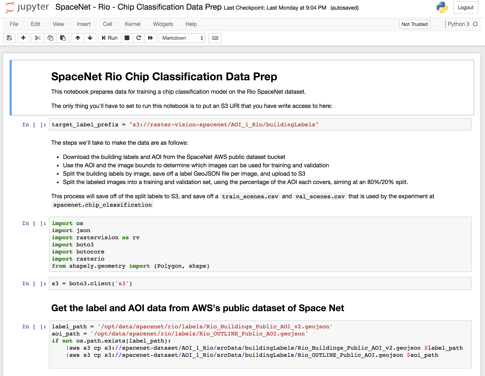
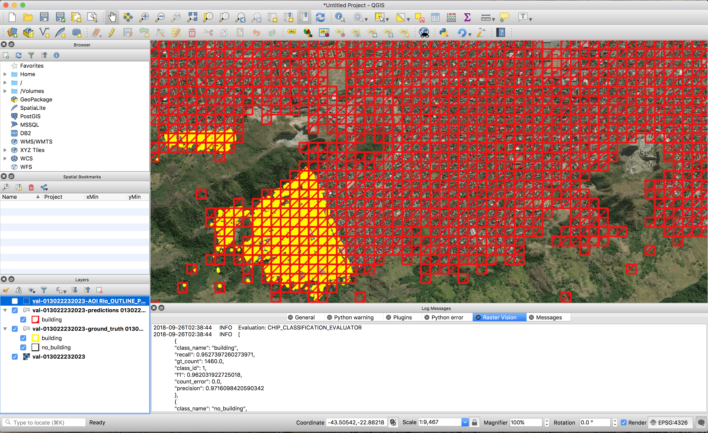
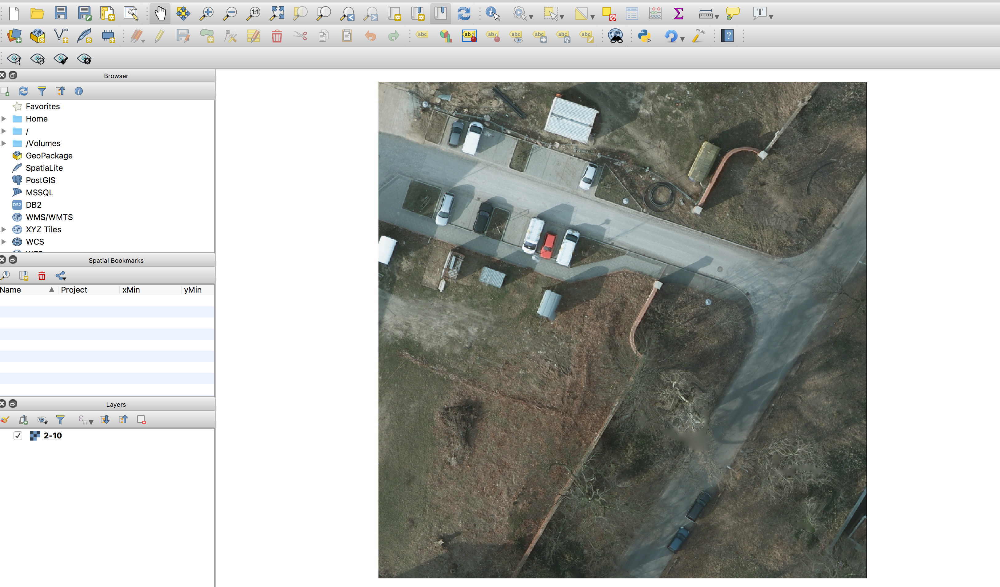
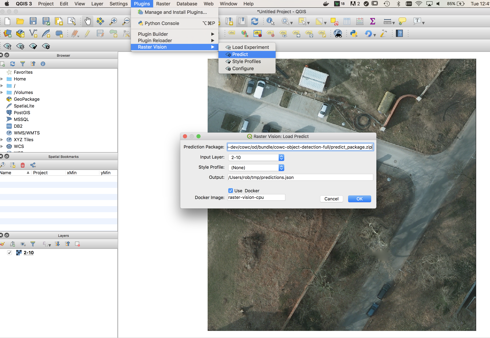
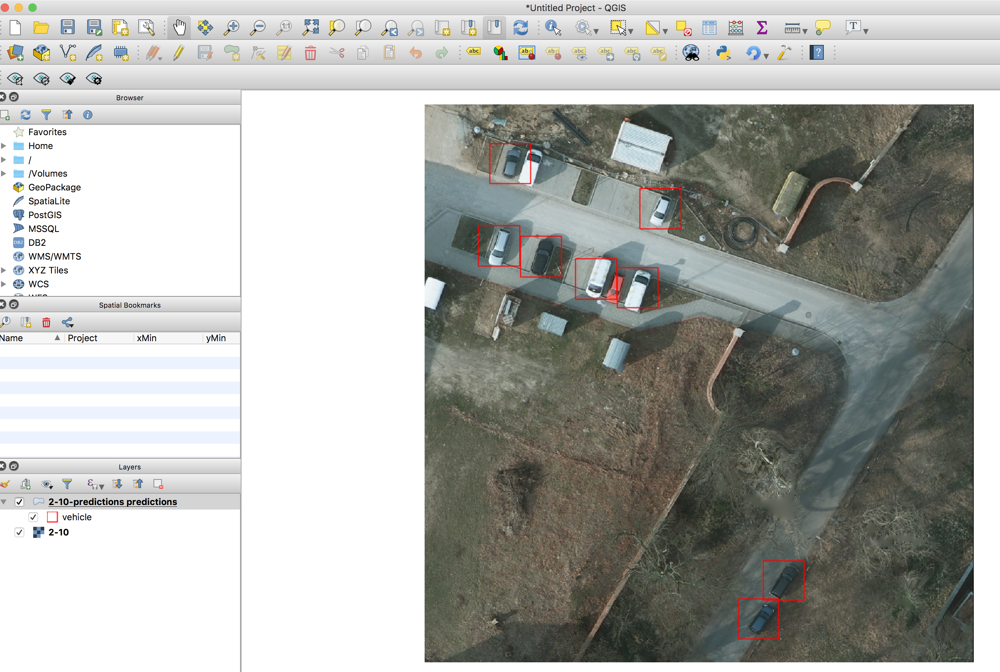
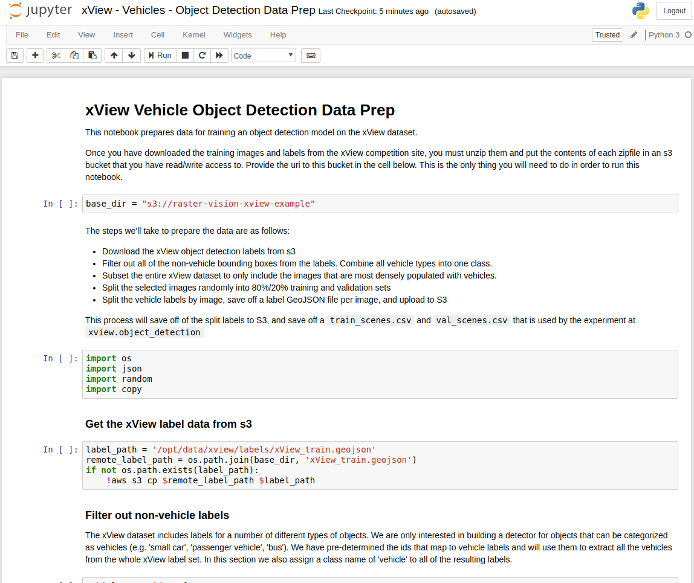

# Raster Vision Example Repository

This repository holds examples for Raster Vision usage on open datasets.

Table of Contents:
- [Setup and Requirements](#setup-and-requirements)
- [Model Zoo](#model-zoo)
- [SpaceNet Rio Building Chip Classification](#spacenet-rio-building-chip-classification)
- [SpaceNet Rio Building Semantic Segmentation](#spacenet-rio-building-semantic-segmentation)
- [Spacenet Vegas Roads and Buildings: All Tasks](#spacenet-vegas)
- [ISPRS Potsdam Semantic Segmentation](#isprs-potsdam-semantic-segmentation)
- [COWC Potsdam Car Object Detection](#cowc-potsdam-car-object-detection)
- [xView Vehicle Object Detection](#xview-vehicle-object-detection)

## Setup and Requirements

### Requirements

You'll need `docker` (preferably version 18 or above) installed.

### Setup

To build the examples container, run the following command:

```shell
> scripts/build
```

This will pull down the latest `raster-vision` docker and add some of this repo's code to it.

### Running the console

Whenever the instructions say to "run the console", it means to spin up an image and drop into a bash shell by doing this:

```shell
> scripts/console
```

This will mount the following directories:
- `${HOME}/.aws` -> `/root/.aws`
- `${HOME}/.rastervision` -> `/root/.rastervision`
- `notebooks` -> `/opt/notebooks`
- `data` -> `/opt/data`
- `spacenet` -> `/opt/src/spacenet`
- `potsdam` -> `/opt/src/potsdam`
- `xview` -> `/opt/src/xview`
- `cowc` -> `/opt/src/cowc`
- `other` -> `/opt/src/other` (This directory is useful for holding Git repos containing examples you want to use with this Docker container.)

### Debug Mode

It can be helpful for debugging purposes to use a local copy of Raster Vision rather than the version baked into the default Docker image (the latest version on Quay). To do this, you can set the `RASTER_VISION_REPO` environment variable to the location of the Raster Vision repo on your local filesystem. If this is set, the `build` script will set the base image to `raster-vision-{cpu,gpu}`. The `console` script will also mount `$RASTER_VISION_REPO/rastervision` to `/opt/src/rastervision` inside the container. You can then set breakpoints in your local copy of Raster Vision in order to debug experiments run inside the container.

In addition, if you would like to mount a custom data directory on your local filesystem into the container, you can set the `RASTER_VISION_DATA_DIR` environment variable before running the `console` script.

### Running Raster Vision

Each example will at some point run the `rastervision` command line. See `rastervision --help` and `rastervision run --help` for usage information.

Use `-a` to pass arguments into the experiment methods; many of which take a `root_uri`, which is where Raster Vision will store all the output of the experiment. If you forget to supply this, Raster Vision will remind you.

Using the `-n` or `--dry-run` flag is useful to see what you're about to run before you run it.
Combine this with the verbose flag for different levels of output:

```
> rastervision run spacenet.rio_chip_classification -a root_uri s3://example/ --dry_run
> rastervision -v run spacenet.rio_chip_classification -a root_uri s3://example/ --dry_run
> rastervision -vv run spacenet.rio_chip_classification -a root_uri s3://example/ --dry_run
```

Use `-x` to avoid checking if files exist, which can take a long time for large experiments.
This is useful to do the first run, but if you haven't changed anything about the experiment and
are sure the files are there, it's often nice to skip that step.

### Running Jupyter

Whenever intructions say to "run jupyter", it means to run the JupyterHub instance through docker by doing:

```shell
> scripts/jupyter
```

This mounts many of the same directories as `scripts/consle`. The terminal output will give you the URL to go to in order to use JupyterHub.

### Running against AWS

If you want to run code against AWS, you'll have to have a Raster Vision AWS Batch setup
on your account, which you can accomplish through the [Raster Vision AWS repository](https://github.com/azavea/raster-vision-aws).

Make sure to set the appropriate configuration in your `$HOME/.rastervision/default` configuration, e.g.

```ini
[AWS_BATCH]
job_queue=rasterVisionQueueStaging
job_definition=raster-vision-gpu
```

### QGIS Plugin

We can inspect results quickly by installing the [QGIS plugin](https://github.com/azavea/raster-vision-qgis). This is an optional step, and requires QGIS 3. See that repository's README for more installation instructions.

### Viewing Tensorboard

During the training step of experiments that have backends that support
[Tensorboard](https://github.com/tensorflow/tensorboard), you should be able to view Tensorboard
at either `localhost:6006/` if you are running locally, or `<public_dns>:6006` if you are running
on AWS, where `<public_dns>` is the pulbic DNS of the instance that is running the training job.

## Model Zoo

| Dataset | Task | Model | Prediction Package | Sample Image | Model (for fine-tuning) |
| --- | --- | --- | --- | --- | --- |
| Spacenet Rio Buildings | Chip Classification | Resnet50 | [link](https://s3.amazonaws.com/azavea-research-public-data/raster-vision/examples/model-zoo/rio-cc/predict_package.zip) | [link](https://s3.amazonaws.com/azavea-research-public-data/raster-vision/examples/model-zoo/rio-cc/013022223130_sample.tif) | [link](https://s3.amazonaws.com/azavea-research-public-data/raster-vision/examples/model-zoo/rio-cc/model-weights.hdf5) |
| Spacenet Vegas Buildings | Semantic Segmentation | Mobilenet | [link](https://s3.amazonaws.com/azavea-research-public-data/raster-vision/examples/model-zoo/vegas-building-seg/predict_package.zip) | [link](https://s3.amazonaws.com/azavea-research-public-data/raster-vision/examples/model-zoo/vegas-building-seg/1929.tif) | n/a |
| Spacenet Vegas Roads | Semantic Segmentation | Mobilenet | [link](https://s3.amazonaws.com/azavea-research-public-data/raster-vision/examples/model-zoo/vegas-road-seg/predict_package.zip) | [link](https://s3.amazonaws.com/azavea-research-public-data/raster-vision/examples/model-zoo/vegas-road-seg/524.tif) | [link](https://s3.amazonaws.com/azavea-research-public-data/raster-vision/examples/model-zoo/vegas-road-seg/roads-mobilenet.tar.gz) |
| ISPRS Potsdam | Semantic Segmentation | Mobilenet | [link](https://s3.amazonaws.com/azavea-research-public-data/raster-vision/examples/model-zoo/potsdam-seg/predict_package.zip) | [link](https://s3.amazonaws.com/azavea-research-public-data/raster-vision/examples/model-zoo/potsdam-seg/3_12_sample.tif) | [link](https://s3.amazonaws.com/azavea-research-public-data/raster-vision/examples/model-zoo/potsdam-seg/model.tar.gz) |
| COWC Potsdam (Cars) | Object Detection | Mobilenet | [link](https://s3.amazonaws.com/azavea-research-public-data/raster-vision/examples/model-zoo/cowc-od/predict_package.zip) | [link](https://s3.amazonaws.com/azavea-research-public-data/raster-vision/examples/model-zoo/cowc-od/3_10_sample.tif) | n/a |
| xView Vehicle | Object Detection | Mobilenet | [link](https://s3.amazonaws.com/azavea-research-public-data/raster-vision/examples/model-zoo/xview-vehicle-od/predict_package.zip) | [link](https://s3.amazonaws.com/azavea-research-public-data/raster-vision/examples/model-zoo/xview-vehicle-od/1677.tif) | n/a |

Using the Model Zoo, you can download prediction packages which contain pre-trained models and configuration, and then run them on sample test images that the model wasn't trained on.

```shell
> rastervision predict <predict_package> <infile> <outfile>
```

It shouldn't take more than a minute on a CPU to make predictions for each sample. For some of the examples, there are also model files that can be used for fine-tuning on another dataset.

**Disclaimer**: These models are provided for testing and demonstration purposes and aren't particularly accurate. As is usually the case for deep learning models, the accuracy drops greatly when used on input that is outside the training distribution. In other words, a model trained in one city probably won't work well in another city (unless they are very similar) or at a different imagery resolution.

## Spacenet Rio Building Chip Classification

This example performs chip classification to detect buildings in the [SpaceNet](https://spacenetchallenge.github.io/) imagery.
It is set up to train on the Rio dataset.

### Step 1: Run the Jupyter Notebook

You'll need to do some data preprocessing, which we can do in the jupyter notebook supplied.

Run jupyter and navigate to the `spacenet/SpaceNet - Rio - Chip Classification Data Prep` notebook.

Run through this notebook (instructions are included).



### Step 2: Run Raster Vision

The experiment we want to run is in `spacenet/rio_chip_classification.py`.

To run this, get into the docker container by typing:

```
> scripts/console
```

You'll need to pass the experiment an S3 URI that you have write access to, that will serve as a place to store results and configuration - this is what we call the _RV root_. You can pass arguments to experiment methods via the `-a KEY VALUE` command line option.

If you are running locally (which means you're running this against a GPU machine with a good connection), run:

```
> rastervision run local -e spacenet.rio_chip_classification -a root_uri ${RVROOT}
```

If you are running on AWS Batch, run:
```
> rastervision run aws_batch -e spacenet.chip_classification -a root_uri ${RVROOT}
```

where `${RVROOT}` is your RV root, for instance `s3://raster-vision-rob-dev/spacenet/cc`

Your console output should look something like this if you are running against AWS:


### Step 3: Inspect Evaluation results

After everything completes, which should take about 3 hours if you're running on AWS with p3.2xlarges,
you should be able to find the `eval/spacenet-rio-chip-classification/eval.json` evaluation
JSON. This is an example of the scores from a run:

```javascript
[
    {
        "gt_count": 1460.0,
        "count_error": 0.0,
        "f1": 0.962031922725018,
        "class_name": "building",
        "recall": 0.9527397260273971,
        "precision": 0.9716098420590342,
        "class_id": 1
    },
    {
        "gt_count": 2314.0,
        "count_error": 0.0,
        "f1": 0.9763865660344931,
        "class_name": "no_building",
        "recall": 0.9822817631806394,
        "precision": 0.9706292067263268,
        "class_id": 2
    },
    {
        "gt_count": 3774.0,
        "count_error": 0.0,
        "f1": 0.970833365390128,
        "class_name": "average",
        "recall": 0.9708532061473236,
        "precision": 0.9710085728062825,
        "class_id": -1
    }
]
```

Which shows us an f1 score of `0.96` for detecting chips with buildings, and an average f1 of `0.97`.

### Step 4: View results through QGIS plugin

Those numbers look good, but seeing the imagery and predictions on a map will look better.
To do this, we utilize the QGIS plugin to pull down one of the validation images.

A walkthrough of using QGIS to inspect these results can be found [in the QGIS plugin README](https://github.com/azavea/raster-vision-qgis#tutorial-view-spacenet-building-chip-classification)

Viewing the validation scene results for scene ID `013022232023` looks like this:




## Spacenet Rio Building Semantic Segmentation

An experiment to do semantic segmentation on Spacenet Rio is available [here](spacenet/rio_semantic_segmentation.py). A prerequisite is having run the [Rio Chip Classification](#spacenet-rio-building-chip-classification) Jupyter notebook. The results should look something like:


```
"overall": [
    {
        "recall": 0.6933642097495366,
        "precision": 0.7181072275154092,
        "class_name": "Building",
        "gt_count": 11480607,
        "count_error": 119679.64457523893,
        "f1": 0.7023217656506746,
        "class_id": 1
    },
    {
        "recall": 0.978149141560173,
        "precision": 0.9763586125303796,
        "class_name": "Background",
        "gt_count": 147757124,
        "count_error": 31820.188126279452,
        "f1": 0.9771849696422493,
        "class_id": 2
    },
    {
        "recall": 0.9576169230896666,
        "precision": 0.9577393905661922,
        "class_name": "average",
        "gt_count": 159237731,
        "count_error": 38154.615804881076,
        "f1": 0.9573680807430468,
        "class_id": null
    }
]
```

## Spacenet Vegas Roads and Buildings: All Tasks <a name="spacenet-vegas"></a>

This example shows how to run an experiment on the [Spacenet Vegas](https://spacenetchallenge.github.io/AOI_Lists/AOI_2_Vegas.html) dataset with the option to choose either roads or buildings, and use any task.

### (Optional) Step 1: Download data

You can run this example both remotely and locally without having to manually download the dataset, as Raster Vision can utilize S3 URIs directly. However, if you want to use locally cached data, you can download and unzip the following files to the data directory: `s3://spacenet-dataset/AOI_2_Vegas/AOI_2_Vegas_Train.tar.gz` (for buildings) and `spacenet-dataset/SpaceNet_Roads_Competition/AOI_2_Vegas_Roads_Train.tar.gz` (for roads).

### Step 2: Run experiment

To run a small experiment locally to test that things are setup properly, invoke
```
rastervision run local -e spacenet.vegas \
    -a test True \
    -a root_uri <root_uri> \
    -a target <target> \
    -a task_type <task_type>
```
where:
* `<root_uri>` is your local RV root, for instance `/opt/data/spacenet-vegas`
* `<target>` can be either `roads` or `buildings`.
* `<task_type>` can be `semantic_segmentation`, `object_detection`, or `chip_classification`. However, only `semantic_segmentation` currently works with `roads`.

If you would like to use data stored locally during Step 1, add the `-a use_remote_data False` flag.

To run a full experiment remotely, invoke
```
rastervision run aws_batch -e spacenet.vegas \
    -a test True \
    -a root_uri <root_uri> \
    -a target <target> \
    -a task_type <task_type>
```
with a remote `<root_uri>`.

Running semantic segmentation on roads trains a Mobilenet for 100k steps which takes about 6hrs on a P3 instance.

#### Experimental: Use vector tiles to get labels

It is possible to use vector tiles as a source of labels in the form of a `{z}/{x}/{y}` schema. We have tested this with a set of vector tiles created from Open Street Map (OSM). Note that most buildings and some roads present in the Spacenet labels are not present in the OSM data. If you are not using OSM, you might need to change the `class_id_to_filter` values in the experiment configuration. Each `class_id_to_filter` is a mapping from `class_id` to a Mapbox GL filter which is to used to assign class ids to features based on their `properties` field. To use vector tiles instead of GeoJSON, run the experiment with the following flag: `-a vector_tile_options "<uri>,<zoom>,<id_field>"`. See the vector tile docs for the develop branch [here](https://docs.rastervision.io/en/latest/api.html#rv-vector-tile-source) for a description of these parameters.

### Step 3: View results

After training a semantic segmentation model on roads, using the QGIS plugin, you should see predictions and an eval similar to the following.


```json
[
    {
        "count_error": 131320.3497452814,
        "precision": 0.79827727905979,
        "f1": 0.7733719736453241,
        "class_name": "Road",
        "class_id": 1,
        "recall": 0.7574370618553649,
        "gt_count": 47364639
    },
    {
        "count_error": 213788.03361026093,
        "precision": 0.9557015578601281,
        "f1": 0.909516065847437,
        "class_name": "Background",
        "class_id": 2,
        "recall": 0.8988113906793058,
        "gt_count": 283875361
    },
    {
        "count_error": 201995.82229692052,
        "precision": 0.9331911601569118,
        "f1": 0.8900485625895702,
        "class_name": "average",
        "class_id": null,
        "recall": 0.8785960059171598,
        "gt_count": 331240000
    }
]
```

## Spacenet Vegas Hyperparameter Tuning Example ##

This example is based on the Las Vegas buildings semantic segmentation example described above.

In this example, we run several related experiments, allowing the base learning rate to vary over them.
These experiments are all related, in that they all work over the same dataset (the Las Vegas buildings data), and in fact the `analyze` and `chip` stages are shared between all of the experiments.
That sharing of early stages is achieving by making sure that the `chip_key` and `analyze_key` are [the same for all of the experiments](spacenet/hyperparameters.py#L80-L81) so that rastervision can detect the redundancy.

To run the experiments on AWS batch type something like:

```bash
rastervision run aws_batch \
	     -e spacenet.hyperparameters \
	     -a use_remote_data True \
	     -a root_uri s3://my-bucket/vegas-hyperparameters \
	     -a learning_rates '0.0001,0.001,0.002,0.003,0.004,0.005,0.10'
	     -x
```

Typing that will train DeepLab models over the Las Vegas buildings dataset with respective base learning rates of 0.0001, 0.001, 0.002, 0.003, 0.004, 0.005, and 0.10.
The number of steps is 10,000 for all experiments.
Because this is for demonstration purposes only, the training dataset has been reduced to only 128 scenes.

The f1 scores for buildings as a function of base learning rate are shown below.

| Base Learning Rate  | Building f1 Score  |
| ------------------- | ------------------ |
| 0.0001              | 0.7337961752864327 |
| 0.001               | 0.7616993477580662 |
| 0.002               | 0.7889177881341606 |
| 0.003               | 0.7864549469541627 |
| 0.004               | 0.4194065664072375 |
| 0.005               | 0.5070458576486434 |
| 0.1                 | 0.5046626369613472 |

The overall f1 scores as a function of base learning rate are shown below.

| Base Learning Rate  | Overall f1 Score   |
| ------------------- | ------------------- |
| 0.0001              | 0.8593602075530826  |
| 0.001               | 0.8714577760700831  |
| 0.002               | 0.8874310574766863  |
| 0.003               | 0.876330712364558   |
| 0.004               | 0.495666977640978   |
| 0.005               | 0.23329045862436176 |
| 0.1                 | 0.2383655704809608  |

(Disclaimer: We are not claiming that the numbers above are useful or interesting, the sole intent here is demonstrate how to vary hyperparameters using rastervision.)

The code can be found [here](spacenet/hyperparameters.py).

## ISPRS Potsdam Semantic Segmentation

This example performs semantic segmentation on the [ISPRS Potsdam dataset](http://www2.isprs.org/commissions/comm3/wg4/2d-sem-label-potsdam.html). The dataset consists of 5cm aerial imagery over Potsdam, Germany, segmented into six classes including building, tree, low vegetation, impervious, car, and clutter. For more info see our [blog post](https://www.azavea.com/blog/2017/05/30/deep-learning-on-aerial-imagery/).

### Step 1: Download the dataset

The dataset can only be downloaded after filling in this [request form](http://www2.isprs.org/commissions/comm3/wg4/data-request-form2.html). After your request is granted, follow the link to 'POTSDAM 2D LABELING' and download and unzip `1_DSM_normalisation.zip`, `4_Ortho_RGBIR.zip`, and `5_Labels_for_participants.zip` into `data/`.

### Step 2: Run experiment

The experiment we want to run is in `potsdam/semantic_segmentation.py`. This runs a Mobilenet using the Tensorflow Deeplab backend for 100k steps, which takes about six hours to train on an AWS P3 instance.

To do a small test run locally to check that things are setup properly, invoke
```
> rastervision run local -e potsdam.semantic_segmentation \
    -a test_run True -a root_uri ${ROOT_URI} -a data_uri ${DATA_URI}
```
This only trains the model for one step, so the predictions will be random.

To run a full experiment on AWS Batch, upload the data to S3, set `ROOT_URI` and `DATA_URI` to S3 URIs, and invoke
```
> rastervision run aws_batch -e potsdam.semantic_segmentation \
    -a root_uri ${ROOT_URI} -a data_uri ${DATA_URI}
```

### Step 3: View results in QGIS plugin

After running for around 6 hours on a P3 instance, you have evaluation metrics and predictions that
look like:

```javascript
[
    {
        "precision": 0.8656729563616176,
        "gt_count": 1746655,
        "class_id": 1,
        "recall": 0.8081258176342782,
        "count_error": 200350.09143477102,
        "class_name": "Car",
        "f1": 0.8351868892794376
    },
    {
        "precision": 0.9077043151132905,
        "gt_count": 28166583,
        "class_id": 2,
        "recall": 0.9453450210840271,
        "count_error": 1496358.1113330645,
        "class_name": "Building",
        "f1": 0.9259374145605163
    },
    {
        "precision": 0.8105826727015737,
        "gt_count": 30140893,
        "class_id": 3,
        "recall": 0.8826813459043832,
        "count_error": 3813131.239710051,
        "class_name": "Low Vegetation",
        "f1": 0.8448803483993653
    },
    {
        "precision": 0.8853166963497794,
        "gt_count": 16928529,
        "class_id": 4,
        "recall": 0.7333917790494379,
        "count_error": 2298428.025324646,
        "class_name": "Tree",
        "f1": 0.798672495115001
    },
    {
        "precision": 0.8905422564785969,
        "gt_count": 29352493,
        "class_id": 5,
        "recall": 0.8771725795147962,
        "count_error": 2346809.6169586345,
        "class_name": "Impervious",
        "f1": 0.883793546499612
    },
    {
        "precision": 0.40612390917761676,
        "gt_count": 1664847,
        "class_id": 6,
        "recall": 0.3042724046113547,
        "count_error": 759642.5306962142,
        "class_name": "Clutter",
        "f1": 0.3474061991276365
    },
    {
        "precision": 0.8640141242953602,
        "gt_count": 108000000,
        "class_id": null,
        "recall": 0.8640043796296297,
        "count_error": 2467470.602260491,
        "class_name": "average",
        "f1": 0.8615277511625675
    }
]
```


## COWC Potsdam Car Object Detection

This example performs object detection on cars with the Cars Overhead With Context dataset over Potsdam, Germany.

### Small local test case

#### Step 1: Download data

Download and unzip the [test data](https://github.com/azavea/raster-vision-data/releases/download/v0.0.1/cowc-potsdam-test.zip) to data/cowc/potsdam-local. These are cropped GeoTIFFs and labels that are a small subset of the full dataset.

Inside the docker container:

```console
> mkdir -p /opt/data/cowc/potsdam-local
> wget -O /opt/data/cowc/potsdam-local/data.zip https://github.com/azavea/raster-vision-data/releases/download/v0.0.1/cowc-potsdam-test.zip
> unzip /opt/data/cowc/potsdam-local/data.zip -d /opt/data/cowc/potsdam-local/
```

#### Step 2: Run the experiment

Inside the docker container, run:

```
> rastervision run local -e cowc.object_detection -m *local
```

You can visit https://localhost:6006/ to view tensorboard as the model trains.

Since this is a local test, you shouldn't expect to see good results -
this was simply a runthrough to show how to train a model locally.

### Running a larger test on the full dataset

The follow describes how to run against a larger set of data.

#### Step 1: Get the data

To run the larger set, follow these steps. Replace `${ROOT_URI}` with the directory that will be passed
into the experiment as `root_uri`, which can be local if you're running on a GPU machine or S3.

* In order to run this section, you'll need to get some data from ISPRS.
Download the [ISPRS Potsdam](http://www2.isprs.org/commissions/comm3/wg4/2d-sem-label-potsdam.html) imagery using the [data request form](http://www2.isprs.org/commissions/comm3/wg4/data-request-form2.html) and place it in `${ROOT_URI}/isprs-potsdam`.
* Copy the [cowc-potsdam labels](https://github.com/azavea/raster-vision-data/releases/download/v0.0.1/cowc-potsdam-labels.zip), unzip, and place the files in `${ROOT_URI}/labels/`. These files were generated from the [COWC car detection dataset](https://gdo152.llnl.gov/cowc/) using scripts in [cowc.data](cowc/data/).

#### Step 2: Run the experiment

Inside the docer container, run

```console
> rastervision run local -e cowc.object_detection -f *full -a root_uri ${ROOT_URI}
```

### See predictions in QGIS

After the model is trained, we can use the "predict package" to make predictions
in QGIS via the QGIS plugin.

#### Step 1: Find the prediction package

This should be at `${ROOT_URI}/bundle/cowc-object-detection-full/predict_package.zip`

#### Step 2: Load up the local image in QGIS

Load up a project in QGIS that has one of the local sample images at
`data/cowc/potsdam-local/cowc-potsdam-test`



#### Step 3: Predict

Use the Predict dialog and set your predict package URI to the URI from Step 1.



After spinning a bit the predictions should look something like this:



## xView Vehicle Object Detection

This example performs object detection to detect vehicles in the xView imagery.
It includes two experiments - one with the smaller [Mobilenet V1](https://github.com/tensorflow/models/blob/5fd32ef62e37a8124bf8849f7bea65fbd8cd7bdd/research/slim/nets/mobilenet_v1.md), and
the other uses a [Faster RCNN utilizning a by RESNET50](https://arxiv.org/abs/1506.01497).

You can either model or both; if you run both, you'll see an example of how a larger network
performs with a significant amount of training data vs a smaller network.

### Step 1: Download the Data

Sign up for an account for the [DIUx xView Detection Challenge](http://xviewdataset.org/). Navigate to the [downloads page](https://challenge.xviewdataset.org/download-links) and download the zipped training images and labels.  Unzip both of these files and upload their contents to an s3 bucket that you have read/write access to. Once this is done, the bucket should contain a labels geojson called `xView_train.geojson` and a directory called `train_images`. You will use the uri to this dataset as input to the data prep Jupyter Notebook in step 2.

### Step 2: Run the Jupyter Notebook

You'll need to do some data preprocessing, which we can do in the jupyter notebook supplied.

Run jupyter and navigate to the `xview/xView - Vehicles - Object Detection Data Prep` notebook.

Run through this notebook (instructions are included).



### Step 3: Run the experiment(s)

To run the mobilenet experiment, inside the docker container run

```
> rastervision run ${RUNNER} -e xview.object_detection -f *mobilenet* -a root_uri ${ROOT_URI} -a data_uri ${DATA_URI}
```

To run the resnet experiment, run

```
> rastervision run ${RUNNER} -e xview.object_detection -f *resnet* -a root_uri ${ROOT_URI} -a data_uri ${DATA_URI}
```

and to run both, simply

```
> rastervision run ${RUNNER} -e xview.object_detection -a root_uri ${ROOT_URI} -a data_uri ${DATA_URI}
```

where `${ROOT_URI}` is the URI set up in jupyter notebook, and ${RUNNER} is
the type of runner you are using, e.g. `local` or `aws_batch`.
